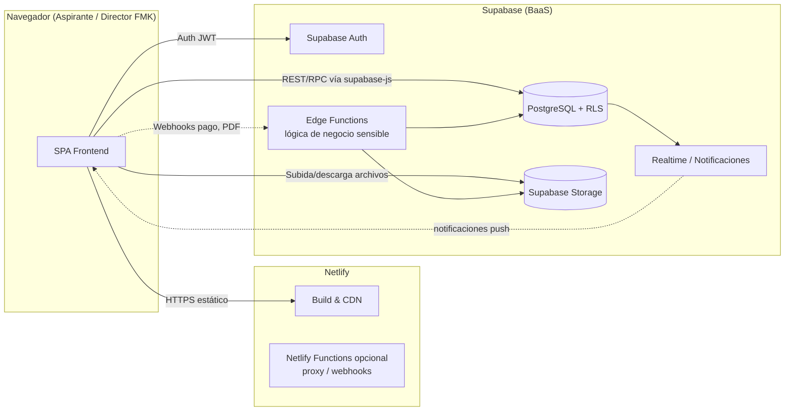
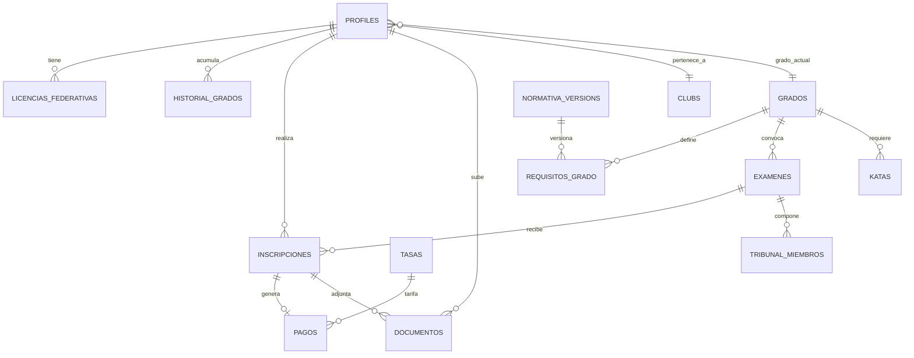

# Especificación de Requisitos de Software (SRS)
## Sistema de Gestión de Grados — Federación Madrileña de Kárate (FMK)

| Campo | Detalle |
|---|---|
| **Documento** | Especificación de Requisitos de Software (SRS) |
| **Producto** | FMK — Sistema de Gestión de Grados (Gestor de Grados) |
| **Versión del documento** | 1.0 |
| **Fecha** | Junio 2026 |
| **Basado en normativa de referencia** | Normativa de Grados FMK 2017 (Dan/Kyu) |
| **Stack objetivo** | Frontend en Netlify · Backend/BaaS en Supabase · Construcción asistida con Codex |
| **Estándar de referencia** | Adaptado de IEEE 830 / ISO·IEC·IEEE 29148 |

---

## Índice

1. Introducción
2. Descripción general del sistema
3. Perfiles de usuario y permisos
4. Arquitectura de la solución
5. Modelo de datos (Supabase / PostgreSQL)
6. Requisitos funcionales por módulo
7. Casos de uso detallados
8. Requisitos no funcionales
9. Reglas de negocio (Normativa de Grados)
10. Requisitos de interfaz de usuario
11. Requisitos de despliegue (Netlify + Supabase) y entornos
12. Plan de construcción con Codex (guía de implementación)
13. Plan de pruebas y criterios de aceptación
14. Seguridad, privacidad y cumplimiento normativo (LOPDGDD/RGPD)
15. Glosario
16. Anexos

---

## 1. Introducción

### 1.1 Propósito
Este documento especifica de manera completa y detallada los requisitos funcionales y no funcionales para el desarrollo del **Sistema de Gestión de Grados de la Federación Madrileña de Kárate (FMK)**, una aplicación web que digitaliza el proceso de validación de requisitos, inscripción, seguimiento y certificación de grados (Kyu/Dan) de los deportistas federados.

El documento está concebido para ser utilizado como **entrada directa para la construcción del producto mediante un agente de generación de código (Codex)**, por lo que cada requisito se redacta de forma atómica, verificable y trazable a una entidad de datos, un componente de interfaz y un criterio de aceptación.

### 1.2 Alcance del sistema
El sistema permitirá:

- Validar de forma automática si un federado cumple los requisitos (edad, permanencia en grado, licencias federativas) para presentarse a un examen de grado, según la Normativa de Grados 2017.
- Gestionar la estructura de exámenes (convocatorias, tribunales, cupos, sedes).
- Gestionar inscripciones a exámenes, incluyendo documentación y pago de tasas.
- Mantener una biblioteca de katas asociadas a cada grado, con material audiovisual de referencia.
- Gestionar tasas/fees por grado y temporada, y su conciliación con pagos.
- Mantener un histórico de grados, exámenes, pagos y documentos por federado, con fines de auditoría y emisión de certificados.
- Ofrecer dos perfiles principales de acceso: **Aspirante** (deportista federado) y **Director FMK** (gestión técnica/administrativa), cada uno con su propio alcance funcional.

Quedan fuera del alcance de la primera versión (V1): pasarela de pago totalmente automatizada con conciliación bancaria, app nativa móvil, federación con otras federaciones autonómicas, y motor de generación automática de diplomas en formatos distintos a PDF.

### 1.3 Definiciones, acrónimos y abreviaturas

| Término | Definición |
|---|---|
| FMK | Federación Madrileña de Kárate |
| Federado / Aspirante | Deportista con licencia federativa en vigor que puede aspirar a un grado |
| Director FMK | Perfil con rol administrativo/técnico que gestiona el sistema |
| Kyu | Grados de cinturón de color, previos al Dan |
| Dan | Grados de cinturón negro (1º a 10º) |
| Kata | Secuencia preestablecida de movimientos técnicos (terminología japonesa) |
| Kumite | Combate o ejercicio de enfrentamiento técnico |
| Apto / No Apto / Pendiente / Exento | Estados posibles del resultado de un examen o de un requisito |
| RLS | Row Level Security (seguridad a nivel de fila en PostgreSQL/Supabase) |
| BaaS | Backend as a Service |
| SRS | Software Requirements Specification |
| RF / RNF | Requisito Funcional / Requisito No Funcional |

### 1.4 Referencias
- Normativa de Grados FMK, versión 2017 (documento normativo origen de las reglas de negocio, Sección 9).
- Sistema de diseño "FMK Grades System" (DESIGN.md, paleta de color, tipografía Inter, layout de 12 columnas) — usado como referencia visual obligatoria.
- Prototipo de referencia: pantalla "Validador de Requisitos" (screen.png / code.html) aportada por el cliente.

### 1.5 Visión general del documento
Las secciones 2 y 3 describen el producto y sus actores. La sección 4 fija la arquitectura técnica (Netlify + Supabase). La sección 5 detalla el modelo de datos. Las secciones 6 y 7 contienen los requisitos funcionales y casos de uso, módulo a módulo. La sección 8 cubre calidad (RNF). La sección 9 formaliza las reglas de negocio de la normativa de grados como reglas computables. Las secciones 10–14 cubren UI, despliegue, plan de construcción con Codex, pruebas y seguridad.

---

## 2. Descripción general del sistema

### 2.1 Perspectiva del producto
Es un producto **nuevo, independiente**, tipo aplicación web (SPA/SSR ligera) con backend gestionado (Supabase), sin sistemas legados que sustituir. Sustituye procesos manuales actuales (hojas de cálculo, validación manual de requisitos por la secretaría técnica, inscripciones en papel/email).

### 2.2 Resumen de funciones del producto
1. **Dashboard** — panel de control con indicadores según el rol.
2. **Validator (Validador de Requisitos)** — motor de elegibilidad grado actual → grado objetivo.
3. **Exam Structure (Estructura de Exámenes)** — gestión de convocatorias, tribunales y sedes.
4. **Enrollment (Inscripción)** — flujo guiado (wizard) de inscripción a examen.
5. **Kata Library (Biblioteca de Katas)** — catálogo de katas por grado con vídeo/descripción.
6. **Fees (Tasas)** — gestión de tarifas por grado/temporada y registro de pagos.
7. **History (Historial)** — histórico de grados, exámenes y pagos por federado.
8. **Notificaciones** — avisos in-app de cambios de estado, plazos y resultados.
9. **Certificados** — generación y descarga de certificado/diploma en PDF.
10. **Administración** — gestión de usuarios, clubes, normativa y auditoría (solo Director FMK).

### 2.3 Perfiles de usuario
Ver desarrollo completo en la sección 3.

### 2.4 Restricciones generales
- El frontend se debe desplegar en **Netlify** (build estático/SSR ligero, sin servidor propio).
- El backend, base de datos, autenticación y almacenamiento de archivos deben implementarse sobre **Supabase** (PostgreSQL + Auth + Storage + Edge Functions), sin servidores adicionales propios.
- El sistema de diseño visual debe respetar la paleta, tipografía (Inter) y reglas de espaciado definidas en `DESIGN.md` (rojo institucional `#8B0000`/`#610000`, secundario `#3C3489`/`#5A53A9`, esquinas de 4px, bordes de 0.5px, badges tipo "pill").
- Idioma único en V1: español (es-ES). Los términos técnicos japoneses (kata, kumite, dan, kyu) se muestran en cursiva con tooltip explicativo.
- El histórico de la normativa debe quedar versionado: cambios en requisitos no deben alterar retroactivamente exámenes ya cerrados.

### 2.5 Supuestos y dependencias
- Existe un dominio propio de la FMK para apuntar a Netlify (DNS gestionado externamente).
- Supabase Storage se usa para fotografías, documentos justificativos y certificados PDF.
- El pago de tasas en V1 puede operar en modo "registro manual conciliado por Director FMK" o integrarse con una pasarela (Stripe/Redsys) mediante Supabase Edge Functions; ambas opciones se contemplan en el diseño de datos (sección 5.9) y se decide en fase de construcción.
- Los usuarios "Aspirante" ya poseen, o se les crea, una licencia federativa registrada en el sistema.

---

## 3. Perfiles de usuario y permisos

El sistema define dos roles de negocio (más un rol técnico de soporte, opcional, explicado al final). Los permisos se aplican tanto en la interfaz (ocultación/deshabilitado de acciones) como, de forma obligatoria, **a nivel de base de datos mediante políticas RLS de Supabase** (la UI nunca es la única barrera de seguridad).

### 3.1 Perfil: Aspirante (federado/deportista)

**Descripción:** Deportista con licencia federativa vigente que consulta su situación de grado, valida su elegibilidad, se inscribe a exámenes, consulta katas obligatorias, paga tasas y descarga su historial/certificados.

**Permisos:**
- Lectura y edición limitada de su propio perfil (`profiles` donde `user_id = auth.uid()`).
- Lectura de su propio histórico de grados, licencias, exámenes, inscripciones, pagos y documentos.
- Uso completo del **Validador de Requisitos** sobre su propio grado actual.
- Creación de inscripciones (`inscripciones`) a convocatorias abiertas para las que es elegible.
- Subida de documentos justificativos propios (Storage, carpeta `documentos/{user_id}/...`).
- Lectura completa de la **Biblioteca de Katas** y de la **Tabla Maestra de Requisitos** (normativa vigente).
- Lectura de tasas vigentes (`tasas`) y registro/confirmación de su propio pago.
- Descarga de su propio certificado cuando el resultado sea "Apto".
- Recepción de notificaciones propias; lectura/marcado como leídas.
- **No puede**: ver datos de otros federados, modificar convocatorias, modificar la normativa, modificar resultados de examen, acceder a auditoría, gestionar usuarios.

### 3.2 Perfil: Director FMK (gestión técnica/administrativa)

**Descripción:** Responsable técnico de la federación (Secretaría Técnica/Dirección Técnica). Administra el ciclo de vida completo de grados, exámenes, inscripciones, normativa, katas, tasas y usuarios. Es el "superusuario" funcional del dominio de negocio.

**Permisos:**
- CRUD completo sobre: `examenes`, `requisitos_grado`, `normativa_versions`, `katas`, `tasas`, `clubs`.
- Lectura y edición de cualquier `profiles`, `historial_grados`, `licencias_federativas`, `inscripciones`, `documentos`, `pagos`.
- Validación y resolución de inscripciones: aprobar, rechazar, marcar como "pendiente de documentación".
- Registro del resultado de examen por federado (Apto / No Apto / Pendiente / Exento) y emisión del certificado correspondiente.
- Ejecución del **Validador de Requisitos** sobre cualquier federado (búsqueda por nombre/licencia).
- Gestión de tribunales y sedes en `Exam Structure`.
- Conciliación de pagos (marcar tasa como pagada/pendiente/reembolsada).
- Acceso a **Auditoría** (`auditoria`): trazabilidad de cambios críticos (resultados, normativa, pagos).
- Exportación de reportes (CSV/Excel/PDF) y panel de Dashboard agregado (federados por grado, exámenes próximos, tasas pendientes).
- Gestión de usuarios: alta de federados, asignación de club, reseteo de acceso, cambio de rol (con doble confirmación).
- Publicación de nuevas versiones de la normativa (sección 9), manteniendo el versionado histórico.

### 3.3 Rol técnico opcional: Tribunal Examinador (extensión futura, fuera de V1 pero contemplado en el modelo de datos)
Visto en el footer del prototipo ("Contacto Tribunal"). En V1 el Director FMK actúa también como gestor del tribunal; el modelo de datos deja preparada la tabla `tribunal_miembros` para una futura tercera persona/rol con acceso de solo lectura a las convocatorias en las que participa y de escritura sobre el resultado de examen de esa convocatoria.

### 3.4 Matriz resumen de permisos

| Módulo | Aspirante | Director FMK |
|---|---|---|
| Dashboard | Vista personal (mi grado, próximos exámenes, notificaciones) | Vista agregada (KPIs federación) |
| Validador de Requisitos | Solo sobre sí mismo | Sobre cualquier federado |
| Exam Structure | Solo lectura (convocatorias abiertas) | CRUD completo |
| Enrollment | Crear/ver/cancelar las propias | Ver todas, aprobar/rechazar, registrar resultado |
| Kata Library | Lectura | CRUD completo |
| Fees | Lectura de tarifas, pago propio | CRUD tarifas, conciliación de pagos |
| History | Histórico propio | Histórico de toda la federación |
| Certificados | Descarga propia | Emisión y reemisión |
| Usuarios/Clubes | — | CRUD completo |
| Normativa | Lectura vigente | CRUD con versionado |
| Auditoría | — | Lectura completa |

---

## 4. Arquitectura de la solución

### 4.1 Visión arquitectónica



### 4.2 Stack tecnológico recomendado

| Capa | Tecnología | Justificación |
|---|---|---|
| Frontend framework | React + Vite (o Next.js en modo *static export*) + TypeScript | Compatible con despliegue estático en Netlify, ecosistema maduro, tipado fuerte para Codex |
| Estilos | Tailwind CSS, configurado con los *design tokens* de `DESIGN.md` | El prototipo ya usa Tailwind; reutilización directa del sistema de diseño |
| Estado/Datos | `@supabase/supabase-js` v2, TanStack Query (React Query) | Cache, *optimistic updates*, manejo de sesión |
| Formularios | React Hook Form + Zod | Validación de esquemas reutilizable cliente/servidor |
| Autenticación | Supabase Auth (email/password + magic link); roles vía tabla `profiles.role` y *custom claims* | Evita backend propio de auth |
| Base de datos | PostgreSQL gestionado por Supabase, con RLS | Seguridad a nivel de fila por defecto |
| Almacenamiento de archivos | Supabase Storage (buckets `documentos`, `certificados`, `katas-media`, `avatars`) | Integrado nativamente con Auth/RLS |
| Lógica de servidor sensible | Supabase Edge Functions (Deno) | Cálculo de elegibilidad oficial, generación de PDF, webhooks de pago |
| Generación de PDF (certificados) | Edge Function con librería PDF (p. ej. `pdf-lib`) | Server-side, evita manipulación desde el cliente |
| Hosting/CDN frontend | Netlify (Sites), *Netlify CLI* + *Build plugins* | Despliegue continuo, *previews* por PR, requisito del cliente |
| CI/CD | GitHub + Netlify (auto-deploy) + Supabase CLI (migraciones) | Entornos reproducibles |
| Construcción asistida | Codex (agente de generación de código) sobre este SRS | Guía detallada en sección 12 |

### 4.3 Principios arquitectónicos
1. **"Database as the source of truth de permisos"**: toda regla de acceso se refuerza con RLS, nunca solo en el cliente.
2. **Cálculo de elegibilidad determinista y trazable**: la función de validación de requisitos vive como una *vista* o *función SQL* (`fn_validar_elegibilidad`) reutilizable tanto por el front (lectura) como por el Edge Function que certifica oficialmente la elegibilidad al inscribir.
3. **Versionado de normativa**: ningún requisito se borra; se versiona, de modo que el histórico siempre pueda recalcularse con la normativa vigente en su momento.
4. **Frontend sin estado de servidor**: 100% desplegable en Netlify como sitio estático con llamadas a Supabase desde el navegador o desde funciones edge.
5. **Separación aspirante/director a nivel de rutas**: `/app/*` (aspirante) y `/admin/*` (Director FMK), con *guards* de ruta basados en `profiles.role`.

---

## 5. Modelo de datos (Supabase / PostgreSQL)

> Convención: todas las tablas incluyen `id uuid primary key default gen_random_uuid()`, `created_at timestamptz default now()`, `updated_at timestamptz default now()` (no repetido en cada fila para brevedad). Claves foráneas a `auth.users(id)` se anotan como `user_id`.

### 5.1 `profiles`
Extiende `auth.users` con datos de negocio.

| Campo | Tipo | Notas |
|---|---|---|
| id | uuid (PK, FK a `auth.users.id`) | |
| role | enum(`aspirante`,`director`,`tribunal`) | default `aspirante` |
| full_name | text | |
| dni_nie | text | único |
| birth_date | date | usado por el validador (edad) |
| phone | text | |
| club_id | uuid (FK `clubs.id`) | nullable |
| license_number | text | único |
| current_grado_id | uuid (FK `grados.id`) | grado vigente |
| current_grado_since | date | inicio de permanencia en grado actual |
| avatar_url | text | Storage bucket `avatars` |
| active | boolean | default true |

### 5.2 `clubs`
`id`, `name`, `address`, `city`, `contact_email`, `contact_phone`.

### 5.3 `grados`
Catálogo ordenado de cinturones/grados.

| Campo | Tipo | Notas |
|---|---|---|
| id | uuid | |
| nombre | text | "Cinturón Blanco", "1º DAN", … |
| tipo | enum(`kyu`,`dan`) | |
| orden | integer | usado para validar progresión secuencial |

### 5.4 `normativa_versions`
| Campo | Tipo | Notas |
|---|---|---|
| id | uuid | |
| nombre | text | "Normativa de Grados 2017" |
| fecha_publicacion | date | |
| pdf_url | text | Storage bucket `normativa` |
| vigente | boolean | solo una versión `true` a la vez |

### 5.5 `requisitos_grado`
Reglas computables por grado objetivo (sección 9), ligadas a una versión de normativa.

| Campo | Tipo | Notas |
|---|---|---|
| id | uuid | |
| normativa_version_id | uuid (FK) | |
| grado_objetivo_id | uuid (FK `grados.id`) | |
| grado_previo_requerido_id | uuid (FK `grados.id`) | nullable |
| edad_minima | integer | años cumplidos el día del examen |
| permanencia_anios | numeric | años mínimos en el grado previo |
| licencias_consecutivas_requeridas | integer | |
| licencias_alternas_requeridas | integer | |
| observaciones | text | |

### 5.6 `licencias_federativas`
| Campo | Tipo | Notas |
|---|---|---|
| id | uuid | |
| federado_id | uuid (FK `profiles.id`) | |
| temporada | text | p. ej. "2025-2026" |
| fecha_inicio | date | |
| fecha_fin | date | |
| estado | enum(`activa`,`vencida`,`anulada`) | |

### 5.7 `historial_grados`
| Campo | Tipo | Notas |
|---|---|---|
| id | uuid | |
| federado_id | uuid (FK) | |
| grado_id | uuid (FK `grados.id`) | |
| fecha_obtencion | date | |
| examen_id | uuid (FK `examenes.id`) | nullable (grados históricos previos al sistema) |
| tribunal | text | |
| certificado_url | text | Storage bucket `certificados` |

### 5.8 `examenes` (Exam Structure)
| Campo | Tipo | Notas |
|---|---|---|
| id | uuid | |
| grado_objetivo_id | uuid (FK) | |
| fecha | timestamptz | |
| sede | text | |
| tribunal | text / jsonb | nombres de los miembros del tribunal |
| cupo_maximo | integer | |
| estado | enum(`borrador`,`abierta`,`cerrada`,`cancelada`) | |
| fecha_limite_inscripcion | timestamptz | |

### 5.9 `inscripciones` (Enrollment)
| Campo | Tipo | Notas |
|---|---|---|
| id | uuid | |
| federado_id | uuid (FK) | |
| examen_id | uuid (FK) | |
| estado | enum(`borrador`,`pendiente_documentacion`,`pendiente_pago`,`pendiente_revision`,`aprobada`,`rechazada`,`completada`,`cancelada`) | |
| resultado | enum(`apto`,`no_apto`,`pendiente`,`exento`) | nullable hasta el examen |
| validacion_snapshot | jsonb | copia del resultado del Validador en el momento de inscribirse (auditable) |
| fecha_inscripcion | timestamptz | |
| observaciones_director | text | |

### 5.10 `documentos`
| Campo | Tipo | Notas |
|---|---|---|
| id | uuid | |
| federado_id | uuid (FK) | |
| inscripcion_id | uuid (FK) | nullable |
| tipo | enum(`dni`,`justificante_grado`,`justificante_pago`,`foto`,`otro`) | |
| url | text | Storage bucket `documentos` |
| estado_verificacion | enum(`pendiente`,`verificado`,`rechazado`) | |

### 5.11 `katas` (Kata Library)
| Campo | Tipo | Notas |
|---|---|---|
| id | uuid | |
| nombre | text | en cursiva en UI |
| grado_id | uuid (FK `grados.id`) | grado al que aplica |
| tipo | enum(`obligatoria`,`libre`) | |
| descripcion | text | |
| video_url | text | |
| origen | text | "Shotokan", "Goju-Ryu", etc. (si aplica) |

### 5.12 `tasas` (Fees)
| Campo | Tipo | Notas |
|---|---|---|
| id | uuid | |
| grado_objetivo_id | uuid (FK) | |
| temporada | text | |
| concepto | text | "Tasa de examen 1º DAN" |
| importe | numeric(10,2) | |
| activa | boolean | |

### 5.13 `pagos`
| Campo | Tipo | Notas |
|---|---|---|
| id | uuid | |
| inscripcion_id | uuid (FK) | |
| tasa_id | uuid (FK) | |
| importe | numeric(10,2) | |
| metodo | enum(`transferencia`,`tarjeta`,`efectivo`,`pasarela`) | |
| estado | enum(`pendiente`,`pagado`,`reembolsado`,`anulado`) | |
| referencia_externa | text | id de pasarela si aplica |
| fecha_pago | timestamptz | |

### 5.14 `notificaciones`
`id`, `user_id` (FK), `tipo` (enum: `inscripcion`,`resultado`,`pago`,`normativa`,`sistema`), `titulo`, `mensaje`, `leido` (boolean), `link` (ruta interna).

### 5.15 `auditoria`
`id`, `user_id` (quién ejecuta), `accion` (texto: `crear`,`actualizar`,`eliminar`,`aprobar`,`rechazar`), `entidad`, `entidad_id`, `detalle` (jsonb, diff de cambios), `timestamp`.

### 5.16 `tribunal_miembros` (preparado para V2)
`id`, `examen_id` (FK), `user_id` (FK, nullable si externo), `nombre`, `rol_en_tribunal` (`presidente`,`vocal`,`secretario`).

### 5.17 Diagrama entidad-relación (resumen)



### 5.18 Políticas RLS (resumen normativo, detalle en sección 14)
- Tabla `profiles`: `select`/`update` propio (`auth.uid() = id`) **o** `role = 'director'`.
- Tablas dependientes de federado (`licencias_federativas`, `historial_grados`, `inscripciones`, `documentos`, `pagos`, `notificaciones`): `select` si `federado_id = auth.uid()` **o** rol `director`; `insert` propio limitado a sus campos; `update`/`delete` reservado a `director` salvo excepciones explícitas (p. ej. el aspirante puede cancelar su propia inscripción en estado `borrador`).
- Tablas maestras (`grados`, `requisitos_grado`, `normativa_versions`, `katas`, `tasas`, `examenes`, `clubs`): `select` público para usuarios autenticados; `insert`/`update`/`delete` exclusivo de `director`.
- Tabla `auditoria`: `select` exclusivo de `director`; `insert` solo vía función de servidor (`security definer`), nunca directo desde el cliente.

---

## 6. Requisitos funcionales por módulo

Cada requisito se identifica como **RF-[Módulo]-[N]**, con prioridad **Alta/Media/Baja** y actor(es) responsables.

### 6.1 Módulo: Autenticación y perfil

| ID | Requisito | Actor | Prioridad |
|---|---|---|---|
| RF-AUTH-01 | El sistema debe permitir registro e inicio de sesión con email y contraseña vía Supabase Auth. | Aspirante, Director | Alta |
| RF-AUTH-02 | El sistema debe soportar inicio de sesión mediante *magic link* (enlace por email) como alternativa. | Aspirante | Media |
| RF-AUTH-03 | Tras el registro, debe crearse automáticamente una fila en `profiles` con `role = 'aspirante'` por defecto (trigger en base de datos). | Sistema | Alta |
| RF-AUTH-04 | Solo un usuario con `role = 'director'` puede promover a otro usuario a `director` o `tribunal`. | Director | Alta |
| RF-AUTH-05 | El sistema debe permitir editar datos personales propios (nombre, teléfono, foto) desde "Settings". | Aspirante, Director | Alta |
| RF-AUTH-06 | El sistema debe cerrar sesión y revocar el JWT al hacer logout. | Todos | Alta |
| RF-AUTH-07 | El sistema debe redirigir a `/app` (área aspirante) o `/admin` (área director) según el rol tras login. | Sistema | Alta |
| RF-AUTH-08 | El sistema debe permitir recuperación de contraseña por email. | Todos | Alta |

### 6.2 Módulo: Dashboard

| ID | Requisito | Actor | Prioridad |
|---|---|---|---|
| RF-DASH-01 (Aspirante) | El dashboard del aspirante debe mostrar: grado actual, tiempo de permanencia en el grado, estado de licencia vigente, próxima convocatoria elegible y notificaciones recientes. | Aspirante | Alta |
| RF-DASH-02 (Aspirante) | El dashboard debe mostrar un acceso directo al Validador con su grado actual precargado. | Aspirante | Alta |
| RF-DASH-03 (Director) | El dashboard del director debe mostrar KPIs: nº de federados activos, exámenes próximos, inscripciones pendientes de revisión, tasas pendientes de cobro. | Director | Alta |
| RF-DASH-04 (Director) | El dashboard del director debe incluir una tabla de "acciones pendientes" (inscripciones por revisar, documentos por verificar). | Director | Alta |
| RF-DASH-05 | El buscador superior ("Buscar federado…") debe estar disponible solo para Director FMK y buscar por nombre, DNI o nº de licencia. | Director | Media |

### 6.3 Módulo: Validador de Requisitos (Validator)

Este es el módulo núcleo del prototipo aportado (pantalla de referencia).

| ID | Requisito | Actor | Prioridad |
|---|---|---|---|
| RF-VAL-01 | El sistema debe ofrecer dos selectores: "Grado actual" y "Grado objetivo", precargando el grado actual real del federado cuando el actor es Aspirante. | Aspirante, Director | Alta |
| RF-VAL-02 | Cuando el actor es Director FMK, el sistema debe permitir buscar y seleccionar primero al federado a validar (sustituye la precarga automática). | Director | Alta |
| RF-VAL-03 | El sistema debe calcular y mostrar, para cada requisito (edad mínima, permanencia en grado, licencias federativas), el valor actual del federado, el valor requerido, y un estado visual (`Apto`/`No Apto`/`Pendiente`) con barra de progreso. | Sistema | Alta |
| RF-VAL-04 | El cálculo de "Edad mínima requerida" debe usar `birth_date` del federado y la fecha del próximo examen elegible (o la fecha actual si no hay convocatoria seleccionada), conforme a la regla "edad cumplida el día del examen" (sección 9). | Sistema | Alta |
| RF-VAL-05 | El cálculo de "Permanencia en grado" debe usar `current_grado_since` frente a `permanencia_anios` del `requisitos_grado` vigente. | Sistema | Alta |
| RF-VAL-06 | El cálculo de "Licencias federativas" debe contar licencias `activa`/históricas consecutivas o alternas según `licencias_consecutivas_requeridas` / `licencias_alternas_requeridas`. | Sistema | Alta |
| RF-VAL-07 | El sistema debe mostrar un bloque de "Estado final" agregando los tres resultados: si todos son `Apto` → "APTO PARA PRESENTARSE" (verde); si alguno es `No Apto` → estado rojo con detalle del requisito incumplido; si hay datos incompletos → "Pendiente de verificar" (ámbar). | Sistema | Alta |
| RF-VAL-08 | Desde el estado "APTO", el sistema debe ofrecer las acciones "Iniciar Inscripción" (lleva al wizard de Enrollment) y, si ya existe un grado obtenido equivalente, "Descargar Certificado". | Aspirante, Director | Alta |
| RF-VAL-09 | El sistema debe mostrar la "Tabla Maestra de Requisitos" (todos los grados Kyu/Dan) como referencia siempre visible, leída desde `requisitos_grado` de la normativa vigente. | Sistema | Alta |
| RF-VAL-10 | Los términos técnicos japoneses dentro del validador (p. ej. "katas obligatorios") deben mostrar tooltip explicativo al pasar el cursor/al pulsar (mobile). | Sistema | Media |
| RF-VAL-11 | El resultado del validador debe poder persistirse como `validacion_snapshot` (jsonb) al iniciar una inscripción, para trazabilidad legal del momento de la validación. | Sistema | Alta |
| RF-VAL-12 | El pie de página del validador debe mostrar la fecha de última actualización de la normativa vigente y enlaces a "Ver Normativa Completa (PDF)" y "Contacto Tribunal". | Sistema | Baja |

### 6.4 Módulo: Exam Structure (Estructura de Exámenes)

| ID | Requisito | Actor | Prioridad |
|---|---|---|---|
| RF-EXM-01 | El Director FMK debe poder crear una convocatoria de examen indicando grado objetivo, fecha, sede, tribunal y cupo máximo. | Director | Alta |
| RF-EXM-02 | El Director FMK debe poder editar y cancelar una convocatoria mientras esté en estado `borrador` o `abierta`. | Director | Alta |
| RF-EXM-03 | El sistema debe impedir cancelar una convocatoria con inscripciones `aprobada`/`completada` sin confirmación explícita y motivo registrado en auditoría. | Sistema | Alta |
| RF-EXM-04 | El sistema debe cerrar automáticamente la convocatoria a inscripciones nuevas al alcanzar `cupo_maximo` o al superar `fecha_limite_inscripcion`. | Sistema | Alta |
| RF-EXM-05 | El Aspirante debe poder ver el listado de convocatorias `abierta` para las que su grado actual es el `grado_previo_requerido` del grado objetivo. | Aspirante | Alta |
| RF-EXM-06 | El Director FMK debe poder definir/editar los miembros del tribunal por convocatoria (texto libre en V1; tabla `tribunal_miembros` en V2). | Director | Media |

### 6.5 Módulo: Enrollment (Inscripción) — Wizard

| ID | Requisito | Actor | Prioridad |
|---|---|---|---|
| RF-ENR-01 | El sistema debe presentar la inscripción como un asistente (*wizard*) de pasos: (1) Validación de requisitos, (2) Datos y documentación, (3) Pago de tasa, (4) Confirmación. | Aspirante | Alta |
| RF-ENR-02 | El paso 1 debe reutilizar el resultado del Validador; si no es "Apto", el wizard debe bloquear el avance y explicar el requisito incumplido. | Sistema | Alta |
| RF-ENR-03 | El paso 2 debe permitir subir documentos requeridos (`documentos`) con validación de formato (PDF/JPG/PNG, máx. 5MB). | Aspirante | Alta |
| RF-ENR-04 | El paso 3 debe mostrar el importe de la tasa correspondiente (`tasas`) y permitir declarar el método de pago o, si hay pasarela activa, redirigir al checkout. | Aspirante | Alta |
| RF-ENR-05 | El paso 4 debe generar la inscripción en estado `pendiente_revision` (si pago manual) o `pendiente_pago` (si pasarela pendiente), y notificar al Director FMK. | Sistema | Alta |
| RF-ENR-06 | El Aspirante debe poder cancelar su inscripción mientras esté en estado `borrador` o `pendiente_documentacion`. | Aspirante | Media |
| RF-ENR-07 | El Director FMK debe poder revisar inscripciones `pendiente_revision`, verificar documentos y pasar a `aprobada` o `rechazada` (con motivo). | Director | Alta |
| RF-ENR-08 | Tras el examen, el Director FMK debe poder registrar el `resultado` (Apto/No Apto/Pendiente/Exento) y pasar la inscripción a `completada`. | Director | Alta |
| RF-ENR-09 | Si el resultado es "Apto", el sistema debe crear automáticamente una fila en `historial_grados` y actualizar `profiles.current_grado_id` / `current_grado_since` del federado. | Sistema | Alta |
| RF-ENR-10 | El sistema debe notificar al Aspirante en cada cambio de estado de su inscripción. | Sistema | Alta |

### 6.6 Módulo: Kata Library (Biblioteca de Katas)

| ID | Requisito | Actor | Prioridad |
|---|---|---|---|
| RF-KAT-01 | El sistema debe listar katas filtrables por grado y tipo (`obligatoria`/`libre`). | Aspirante, Director | Alta |
| RF-KAT-02 | Cada ficha de kata debe mostrar nombre (en cursiva), descripción, vídeo de referencia (embed) y grado asociado. | Sistema | Alta |
| RF-KAT-03 | El Director FMK debe poder crear, editar y desactivar katas del catálogo. | Director | Alta |
| RF-KAT-04 | El Validador y el wizard de Enrollment deben enlazar directamente a las katas obligatorias del grado objetivo seleccionado. | Sistema | Media |

### 6.7 Módulo: Fees (Tasas)

| ID | Requisito | Actor | Prioridad |
|---|---|---|---|
| RF-FEE-01 | El Director FMK debe poder definir tarifas por grado objetivo y temporada. | Director | Alta |
| RF-FEE-02 | El Aspirante debe ver la tarifa vigente correspondiente a su grado objetivo antes de inscribirse. | Aspirante | Alta |
| RF-FEE-03 | El Director FMK debe poder marcar un pago como `pagado`, `pendiente` o `reembolsado`, con fecha y referencia. | Director | Alta |
| RF-FEE-04 | El sistema debe listar al Director FMK todas las tasas pendientes de cobro, agrupadas por convocatoria. | Director | Media |
| RF-FEE-05 | El sistema debe emitir un comprobante/justificante de pago descargable (PDF simple) tras conciliar un pago. | Sistema | Media |

### 6.8 Módulo: History (Historial)

| ID | Requisito | Actor | Prioridad |
|---|---|---|---|
| RF-HIS-01 | El Aspirante debe poder consultar su histórico completo: grados obtenidos, exámenes presentados (con resultado), licencias y pagos. | Aspirante | Alta |
| RF-HIS-02 | El Director FMK debe poder consultar el histórico de cualquier federado y exportarlo (CSV/PDF). | Director | Alta |
| RF-HIS-03 | El histórico debe ser de solo lectura para el Aspirante (no editable). | Sistema | Alta |
| RF-HIS-04 | El sistema debe permitir al Director FMK filtrar el histórico global por grado, club, rango de fechas y resultado. | Director | Media |

### 6.9 Módulo: Notificaciones

| ID | Requisito | Actor | Prioridad |
|---|---|---|---|
| RF-NOT-01 | El sistema debe generar notificaciones automáticas ante: cambio de estado de inscripción, resultado de examen, nueva convocatoria elegible, publicación de nueva normativa. | Sistema | Alta |
| RF-NOT-02 | El icono de campana debe mostrar un contador de no leídas y desplegar la lista al hacer clic. | Sistema | Alta |
| RF-NOT-03 | (Opcional V1.1) El sistema puede enviar copia por email de notificaciones críticas (resultado de examen) vía Supabase Edge Function + proveedor SMTP/Resend. | Sistema | Baja |

### 6.10 Módulo: Certificados

| ID | Requisito | Actor | Prioridad |
|---|---|---|---|
| RF-CER-01 | Al marcar una inscripción como "Apto", el sistema debe generar automáticamente un certificado PDF (Edge Function) con los datos del federado, grado obtenido, fecha y tribunal. | Sistema | Alta |
| RF-CER-02 | El certificado debe almacenarse en Storage (`certificados`) y enlazarse en `historial_grados.certificado_url`. | Sistema | Alta |
| RF-CER-03 | El Aspirante debe poder descargar sus propios certificados desde "History" o desde el botón del Validador. | Aspirante | Alta |
| RF-CER-04 | El Director FMK debe poder reemitir un certificado (p. ej. por corrección de datos), quedando registrado en auditoría. | Director | Media |

### 6.11 Módulo: Administración (solo Director FMK)

| ID | Requisito | Actor | Prioridad |
|---|---|---|---|
| RF-ADM-01 | El Director FMK debe poder gestionar clubes (alta/edición/baja). | Director | Media |
| RF-ADM-02 | El Director FMK debe poder gestionar usuarios: ver listado, cambiar rol, activar/desactivar cuenta. | Director | Alta |
| RF-ADM-03 | El Director FMK debe poder publicar una nueva versión de la normativa, definiendo los nuevos `requisitos_grado`, marcándola como vigente y archivando la anterior. | Director | Alta |
| RF-ADM-04 | El sistema debe registrar en `auditoria` cualquier cambio sobre normativa, resultados de examen y pagos. | Sistema | Alta |
| RF-ADM-05 | El Director FMK debe poder consultar el log de auditoría con filtros por usuario, entidad y rango de fechas. | Director | Media |

---

## 7. Casos de uso detallados

### CU-01 — Validar elegibilidad propia (Aspirante)
- **Actor principal:** Aspirante.
- **Precondición:** Sesión iniciada; perfil con `birth_date` y `current_grado_id` completos.
- **Flujo principal:**
  1. El aspirante accede a "Validator".
  2. El sistema precarga su grado actual y le solicita seleccionar el grado objetivo.
  3. El sistema ejecuta `fn_validar_elegibilidad(federado_id, grado_objetivo_id)`.
  4. El sistema muestra el detalle de los tres requisitos y el estado final.
  5. Si "Apto", el aspirante pulsa "Iniciar Inscripción" → CU-03.
- **Flujos alternativos:**
  - 3a. Datos de perfil incompletos → el sistema muestra estado "Pendiente" y enlaza a "Settings" para completarlos.
  - 4a. "No Apto" → el sistema resalta en rojo el/los requisito(s) incumplidos con el detalle numérico de la diferencia (p. ej. "faltan 3 meses de permanencia").
- **Postcondición:** Resultado mostrado en pantalla; no persiste salvo que se inicie inscripción.

### CU-02 — Validar elegibilidad de un federado (Director FMK)
- Igual que CU-01, pero el paso 1 incluye: el director busca al federado por nombre/DNI/licencia en el buscador superior, y el sistema carga su perfil antes de ejecutar la validación.

### CU-03 — Inscribirse a un examen (Aspirante)
- **Precondición:** Resultado del Validador = "Apto"; existe convocatoria `abierta` para el grado objetivo.
- **Flujo principal:**
  1. El sistema crea una inscripción en `borrador` y guarda `validacion_snapshot`.
  2. El aspirante sube documentación requerida (paso 2).
  3. El aspirante confirma método de pago o paga vía pasarela (paso 3).
  4. El sistema pasa la inscripción a `pendiente_revision` o `pendiente_pago` y notifica al Director FMK (paso 4).
- **Postcondición:** Inscripción visible para el Director FMK en su panel de "acciones pendientes".

### CU-04 — Revisar y aprobar inscripción (Director FMK)
- **Flujo principal:**
  1. El director abre la lista de inscripciones `pendiente_revision`.
  2. Revisa documentos adjuntos y los marca `verificado`/`rechazado`.
  3. Si todo es correcto, aprueba la inscripción (`aprobada`); si falta algo, la pasa a `pendiente_documentacion` con comentario.
  4. El sistema notifica al aspirante del nuevo estado.

### CU-05 — Registrar resultado de examen (Director FMK)
- **Precondición:** Convocatoria con fecha pasada o en curso; inscripción en `aprobada`.
- **Flujo principal:**
  1. El director abre la convocatoria y, por cada inscrito, selecciona resultado (Apto/No Apto/Pendiente/Exento).
  2. El sistema marca la inscripción `completada`.
  3. Si "Apto": el sistema crea `historial_grados`, actualiza `profiles.current_grado_id`/`current_grado_since`, genera certificado (RF-CER-01) y notifica al aspirante.
  4. Si "No Apto"/"Pendiente": el sistema solo notifica, sin modificar el grado actual.

### CU-06 — Publicar nueva versión de normativa (Director FMK)
- **Flujo principal:**
  1. El director crea una nueva fila en `normativa_versions` (`vigente = false` inicialmente).
  2. Define/edita los `requisitos_grado` asociados a la nueva versión.
  3. Al confirmar publicación, el sistema marca la nueva versión `vigente = true` y la anterior `vigente = false` de forma transaccional.
  4. El sistema notifica a todos los aspirantes activos del cambio normativo.
- **Regla:** las convocatorias y validaciones ya cerradas conservan la referencia a la versión de normativa con la que se calcularon (no se recalculan retroactivamente).

### CU-07 — Consultar biblioteca de katas (Aspirante)
- Flujo simple de lectura filtrada por grado; sin pasos críticos de negocio.

### CU-08 — Conciliar pago de tasa (Director FMK)
- **Flujo principal:**
  1. El director localiza la inscripción/tasa pendiente.
  2. Registra el pago (importe, método, fecha, referencia).
  3. El sistema marca `pagos.estado = 'pagado'` y genera comprobante (RF-FEE-05).
  4. El sistema notifica al aspirante.

---

## 8. Requisitos no funcionales

| ID | Categoría | Requisito |
|---|---|---|
| RNF-01 | Rendimiento | El Validador debe devolver el resultado de elegibilidad en menos de 1.5s en condiciones normales de red (cálculo vía función SQL indexada, no en el cliente). |
| RNF-02 | Rendimiento | El *Time to Interactive* de las páginas principales (Dashboard, Validator) debe ser ≤ 2.5s en conexión 4G simulada (Lighthouse ≥ 85 en Performance). |
| RNF-03 | Disponibilidad | El sistema debe apuntar a un SLA de disponibilidad ≥ 99.5%, heredado de Netlify (frontend) y Supabase (backend gestionado). |
| RNF-04 | Escalabilidad | El modelo de datos y las consultas deben soportar al menos 10.000 federados y 50.000 inscripciones históricas sin degradación relevante (índices en `federado_id`, `examen_id`, `estado`). |
| RNF-05 | Seguridad | Toda comunicación debe ir sobre HTTPS (Netlify y Supabase lo proveen por defecto). |
| RNF-06 | Seguridad | Acceso a datos restringido por RLS en el 100% de las tablas con datos personales (sin excepciones de tablas "abiertas" por error). |
| RNF-07 | Seguridad | Las contraseñas y tokens se gestionan exclusivamente por Supabase Auth; el frontend nunca almacena credenciales en `localStorage` sin cifrado de sesión gestionado por la librería oficial. |
| RNF-08 | Usabilidad | Cumplimiento de pautas WCAG 2.1 nivel AA en contraste de color y navegación por teclado, manteniendo la paleta institucional de `DESIGN.md`. |
| RNF-09 | Usabilidad | El sistema debe ser responsive: sidebar fija de 260px en escritorio, colapsable a 64px (iconos) en pantallas medianas, y navegación inferior/menú hamburguesa en móvil. |
| RNF-10 | Mantenibilidad | El código debe seguir una arquitectura modular por dominio (carpetas `validator/`, `enrollment/`, `exams/`, `katas/`, `fees/`, `history/`, `admin/`), con componentes y *hooks* reutilizables, para facilitar tareas incrementales con Codex. |
| RNF-11 | Auditabilidad | Toda acción crítica (resultado, normativa, pago, cambio de rol) debe quedar registrada en `auditoria` de forma inmutable (sin `update`/`delete` permitido sobre esa tabla, solo `insert`). |
| RNF-12 | Internacionalización | Aunque V1 es solo es-ES, los textos de UI deben extraerse a un diccionario (`i18n`) para facilitar una futura traducción. |
| RNF-13 | Compatibilidad | Soporte en las dos últimas versiones de Chrome, Edge, Firefox y Safari (desktop y mobile). |
| RNF-14 | Backups | Se debe habilitar el *Point-in-Time Recovery* / backups diarios de Supabase para la base de datos de producción. |
| RNF-15 | Observabilidad | Se debe integrar *logging* de errores del frontend (p. ej. Sentry) y monitorización de Edge Functions vía logs de Supabase. |
| RNF-16 | Portabilidad de datos | El Director FMK debe poder exportar el histórico completo en formato CSV/JSON para cumplir con eventuales auditorías federativas externas. |

---

## 9. Reglas de negocio (Normativa de Grados — formalización computable)

Estas reglas alimentan la tabla `requisitos_grado` y la función `fn_validar_elegibilidad`. Se documentan aquí los valores observados en la Normativa 2017 (tabla maestra del prototipo), que deben cargarse como **datos semilla (seed)**, no como lógica fija en código, para permitir su actualización vía CU-06.

| Grado objetivo | Edad mínima | Permanencia en grado previo | Licencias requeridas | Observaciones |
|---|---|---|---|---|
| 1º DAN | 16 años | 1 año en Cinturón Marrón | 3 consecutivas o 4 alternas | Edad cumplida el día del examen |
| 2º DAN | 18 años | 2 años en 1º DAN | 2 consecutivas o 3 alternas | Presentar justificante de grado anterior |
| 3º DAN | 21 años | 3 años en 2º DAN | 3 consecutivas o 4 alternas | — |
| 4º DAN | 25 años | 4 años en 3º DAN | 4 consecutivas o 5 alternas | Posibilidad de méritos deportivos |
| 5º DAN | 30 años | 5 años en 4º DAN | 5 consecutivas o 6 alternas | Tribunal Nacional |
| 6º–10º DAN | Variable | 6–10 años (progresivo) | Consultar normativa | Grados de Alto Nivel y Recompensas; aprobación caso a caso por el Director FMK |

**Reglas formales:**

- **RN-01 (Edad):** `edad_en_fecha_examen(federado.birth_date, examen.fecha) >= requisito.edad_minima`. Si no hay convocatoria seleccionada, se usa la fecha actual como referencia provisional (estado "Pendiente de confirmar fecha").
- **RN-02 (Permanencia):** `(fecha_referencia - federado.current_grado_since) en años >= requisito.permanencia_anios`, y además `federado.current_grado_id == requisito.grado_previo_requerido_id` (no se permite "saltar" grados).
- **RN-03 (Licencias):** se cuentan las licencias en estado `activa` o histórico con `estado != 'anulada'` del federado; deben cumplir **o bien** `licencias_consecutivas_requeridas` consecutivas (temporadas correlativas sin hueco) **o bien** `licencias_alternas_requeridas` en cualquier distribución dentro del periodo de permanencia.
- **RN-04 (Estado agregado):**
  - Todos los requisitos `Apto` → resultado global **Apto para presentarse**.
  - Algún requisito `No Apto` (umbral no alcanzado) → resultado global **No Apto**, listando el/los requisito(s) fallido(s).
  - Algún dato necesario ausente (p. ej. sin licencias registradas) → resultado global **Pendiente**.
  - Grados especiales/honoríficos o casos exentos definidos manualmente por el Director FMK → resultado **Exento**, con justificación obligatoria registrada en `inscripciones.observaciones_director`.
- **RN-05 (No retroactividad):** una inscripción ya `completada` mantiene el `validacion_snapshot` calculado con la normativa vigente en el momento de la inscripción, aunque posteriormente se publique una nueva versión de normativa.
- **RN-06 (Progresión secuencial):** no se permite seleccionar como "grado objetivo" un grado cuyo `orden` no sea inmediatamente posterior al `current_grado_id` del federado, salvo excepción manual justificada por el Director FMK (caso `Exento`).

---

## 10. Requisitos de interfaz de usuario

La interfaz debe respetar estrictamente el sistema de diseño aportado (`DESIGN.md`) y el prototipo de referencia (`code.html` / `screen.png`).

### 10.1 Lineamientos generales obligatorios
- **Tipografía:** Inter en toda la aplicación; *headings* y *labels* en *sentence case* (p. ej. "Confirmar asistencia", nunca en mayúsculas sostenidas salvo *labels* de 11–12px ya definidos como tal).
- **Términos japoneses** (*kata*, *kumite*, *dan*, *kyu*) en cursiva en texto de cuerpo, con tooltip on-hover/tap explicativo.
- **Paleta:** primario `#610000`/`#8B0000` (acciones de alto énfasis, navegación activa); secundario `#5A53A9`/`#3C3489` (acciones secundarias, wizards); fondo `#FFF8F6`; superficie de tarjetas `#F0F0F0`/`surface-container-low`.
- **Badges de estado** (pill, full-radius): Apto = verde, No Apto = rojo, Pendiente = ámbar, Exento = azul. Reutilizar exactamente estos cuatro estados en Validator, Enrollment y History.
- **Bordes:** 0.5px sólidos en tono `outline-variant` (`#E3BEB8`); sin *drop shadows*; profundidad por tono, no por sombra.
- **Radios:** 4px estándar (botones, inputs, tarjetas), 8px en modales y contenedores principales, *pill* solo en badges/tags.
- **Layout:** grid de 12 columnas, *gutter* 20px; sidebar fija de 260px (colapsable a 64px); contenido máximo `1280px` centrado; márgenes 24px desktop / 16px mobile.
- **Indicadores de progreso (wizard de Enrollment):** pasos horizontales, paso activo en color secundario y negrita, pasos completados con check, pasos pendientes en escala de grises.
- **Validación de formularios:** borde de 1px en color de estado (rojo error/verde éxito); texto de error en 11px justo debajo del campo.

### 10.2 Mapa de pantallas (rutas sugeridas)

| Ruta | Pantalla | Rol |
|---|---|---|
| `/login`, `/registro`, `/recuperar-password` | Autenticación | Público |
| `/app` | Dashboard Aspirante | Aspirante |
| `/app/validator` | Validador de Requisitos | Aspirante |
| `/app/exams` | Convocatorias abiertas | Aspirante |
| `/app/enrollment/:examId` | Wizard de inscripción | Aspirante |
| `/app/katas` | Biblioteca de katas | Aspirante |
| `/app/fees` | Mis tasas y pagos | Aspirante |
| `/app/history` | Mi historial | Aspirante |
| `/app/settings` | Mi perfil | Aspirante |
| `/admin` | Dashboard Director | Director |
| `/admin/validator` | Validador (búsqueda de federado) | Director |
| `/admin/exams` | Exam Structure (CRUD) | Director |
| `/admin/enrollments` | Revisión de inscripciones | Director |
| `/admin/katas` | Gestión de katas | Director |
| `/admin/fees` | Gestión de tasas y conciliación | Director |
| `/admin/history` | Historial global / reportes | Director |
| `/admin/users` | Gestión de usuarios y clubes | Director |
| `/admin/normativa` | Versionado de normativa | Director |
| `/admin/audit` | Auditoría | Director |

### 10.3 Accesibilidad
- Contraste mínimo AA en todos los textos sobre fondo (`on-surface` sobre `surface`, `on-primary` sobre `primary`).
- Navegación 100% operable por teclado (sidebar, wizard, tablas).
- Etiquetas `aria-*` en badges de estado y en iconografía Material Symbols sin texto visible.

---

## 11. Requisitos de despliegue (Netlify + Supabase) y entornos

### 11.1 Entornos
| Entorno | Frontend (Netlify) | Backend (Supabase) | Propósito |
|---|---|---|---|
| Desarrollo local | `netlify dev` / `vite dev` | Proyecto Supabase de desarrollo (o `supabase start` local con Docker) | Desarrollo asistido por Codex |
| Preview/QA | *Deploy previews* automáticos de Netlify por cada Pull Request | Proyecto Supabase de *staging* compartido | Validación funcional antes de producción |
| Producción | Site de Netlify en dominio propio FMK | Proyecto Supabase de producción | Operación real |

### 11.2 Configuración Netlify
- Repositorio conectado vía GitHub; *build command* (`npm run build`), *publish directory* (`dist`).
- Variables de entorno en Netlify: `VITE_SUPABASE_URL`, `VITE_SUPABASE_ANON_KEY` (claves públicas únicamente; la `service_role key` **nunca** se expone al frontend ni a Netlify Functions públicas).
- *Deploy previews* habilitados para cada PR, apuntando al proyecto Supabase de *staging*.
- Redirecciones SPA: regla `/* -> /index.html 200` en `netlify.toml` para *client-side routing*.
- Dominio propio + HTTPS automático (Let's Encrypt vía Netlify).
- *Build plugins* recomendados: *Lighthouse plugin* para controlar RNF-02 en cada PR.

### 11.3 Configuración Supabase
- Migraciones de base de datos versionadas con **Supabase CLI** (`supabase/migrations/*.sql`), aplicadas en CI antes del *deploy* de frontend.
- Buckets de Storage: `avatars` (público lectura), `documentos` (privado), `certificados` (privado, lectura propia + director), `katas-media` (público lectura), `normativa` (público lectura).
- Edge Functions desplegadas vía `supabase functions deploy`: `validar-elegibilidad-oficial`, `generar-certificado-pdf`, `webhook-pago` (si se integra pasarela), `enviar-notificacion-email` (opcional V1.1).
- Políticas RLS aplicadas y testeadas como parte del pipeline de migraciones (no se despliega a producción sin RLS activo en tablas con datos personales).

### 11.4 Pipeline de CI/CD sugerido
1. *Push*/PR a GitHub → Netlify genera *deploy preview* automáticamente.
2. Acción de GitHub (`supabase db push` contra *staging*) aplica migraciones pendientes.
3. *Merge* a `main` → Netlify despliega a producción; acción de GitHub aplica migraciones a Supabase producción (con confirmación manual en cambios destructivos).
4. *Tag* de versión para *releases* y trazabilidad del SRS frente al código entregado.

### 11.5 `netlify.toml` (esqueleto de referencia)
```toml
[build]
  command = "npm run build"
  publish = "dist"

[[redirects]]
  from = "/*"
  to = "/index.html"
  status = 200

[build.environment]
  NODE_VERSION = "20"
```

---

## 12. Plan de construcción con Codex (guía de implementación)

Esta sección traduce el SRS en una **secuencia de tareas atómicas** apta para ejecutarse con un agente Codex, módulo a módulo, minimizando el riesgo de generar código inconsistente con el modelo de datos.

### 12.1 Principios para las tareas de Codex
- Cada tarea debe referenciar el/los **RF-ID** que implementa y la(s) tabla(s) del modelo de datos involucradas.
- Toda tarea que toque datos debe incluir la migración SQL (con RLS) **antes** del componente de UI que la consume.
- Las tareas deben ser revisables de forma independiente (PRs pequeños) y desplegables vía *preview* de Netlify.

### 12.2 Hoja de ruta sugerida (orden de implementación)

| Fase | Entregable | RF cubiertos |
|---|---|---|
| 0. Bootstrap | Repo + Vite/React/TS + Tailwind con tokens de `DESIGN.md` + conexión Supabase + `netlify.toml` | — |
| 1. Esquema de datos | Migraciones SQL de las 17 tablas (sección 5) + políticas RLS + datos semilla de `grados`, `requisitos_grado` (Normativa 2017), `katas` básicas | Base para todos |
| 2. Autenticación y perfiles | Registro/login, trigger de creación de `profiles`, *route guards* por rol | RF-AUTH-01…08 |
| 3. Validador de Requisitos | Función SQL `fn_validar_elegibilidad` + pantalla Validator (Aspirante y Director) | RF-VAL-01…12 |
| 4. Exam Structure | CRUD de convocatorias (solo Director) + listado público de convocatorias abiertas | RF-EXM-01…06 |
| 5. Enrollment | Wizard de 4 pasos + estados de inscripción + panel de revisión del Director | RF-ENR-01…10, CU-03/CU-04/CU-05 |
| 6. Kata Library | CRUD katas (Director) + catálogo filtrable (Aspirante) | RF-KAT-01…04 |
| 7. Fees | Gestión de tarifas + conciliación de pagos + comprobantes | RF-FEE-01…05 |
| 8. Certificados | Edge Function de generación de PDF + descarga | RF-CER-01…04 |
| 9. History & Dashboard | Vistas agregadas, KPIs, exportación CSV | RF-HIS-01…04, RF-DASH-01…05 |
| 10. Notificaciones | Tabla + *realtime* + UI de campana | RF-NOT-01…03 |
| 11. Administración y Auditoría | Usuarios, clubes, versionado de normativa, log de auditoría | RF-ADM-01…05 |
| 12. Endurecimiento | Accesibilidad (RNF-08/09), *performance* (RNF-01/02), *logging* (RNF-15) | RNF-* |

### 12.3 Ejemplo de instrucción atómica para Codex (plantilla)
```
Tarea: Implementar RF-VAL-03..RF-VAL-07
Contexto: módulo Validator, tabla requisitos_grado, función SQL fn_validar_elegibilidad ya migrada.
Entrada: federado_id, grado_objetivo_id, fecha_referencia opcional.
Salida esperada: componente <ValidatorPanel /> que consuma fn_validar_elegibilidad vía RPC de supabase-js,
muestre 3 bloques de requisito (edad, permanencia, licencias) con badge de estado y barra de progreso,
y un bloque de "Estado final" según RN-04.
Restricciones: usar Tailwind con tokens de DESIGN.md; sentence case; sin lógica de negocio en el cliente
más allá del formateo (el cálculo vive en SQL).
Criterio de aceptación: ver sección 13, CA-VAL-01 a CA-VAL-04.
```

### 12.4 Buenas prácticas para el agente
- Generar primero los *types* TypeScript a partir del esquema de Supabase (`supabase gen types typescript`) y reutilizarlos en todo el frontend.
- No duplicar reglas de negocio en frontend y backend: el frontend solo **muestra** el resultado de funciones SQL/Edge Functions.
- Cada componente de pantalla debe acompañarse de su prueba (sección 13) en el mismo PR.

---

## 13. Plan de pruebas y criterios de aceptación

### 13.1 Niveles de prueba
- **Unitarias:** funciones puras de formateo/UI (Vitest/Jest).
- **Integración:** funciones SQL (`fn_validar_elegibilidad`) y políticas RLS, probadas con `supabase test` / `pgTAP`.
- **End-to-end:** flujos completos (login → validar → inscribir → aprobar → resultado → certificado) con Playwright/Cypress sobre *deploy previews* de Netlify.
- **Accesibilidad:** *axe-core* automatizado en CI sobre las pantallas principales.

### 13.2 Criterios de aceptación (ejemplos representativos)

| ID | Criterio |
|---|---|
| CA-VAL-01 | Dado un federado con `current_grado_id` = Cinturón Marrón, `current_grado_since` hace 18 meses, edad 24 años y 3 licencias consecutivas, al validar contra 1º DAN el sistema debe mostrar los tres requisitos en "Apto" y el estado final "APTO PARA PRESENTARSE". |
| CA-VAL-02 | Dado un federado con solo 8 meses de permanencia en Marrón, al validar contra 1º DAN el requisito "Permanencia en grado" debe mostrar "No Apto" con el detalle "Actual: 0.8 años · Requerido: 1 año", y el estado final debe ser "No Apto", bloqueando el botón "Iniciar Inscripción". |
| CA-ENR-01 | Un aspirante no puede avanzar al paso 2 del wizard de Enrollment si el resultado del Validador no es "Apto". |
| CA-ENR-02 | Al aprobar una inscripción con resultado "Apto", el sistema debe crear una fila en `historial_grados`, actualizar el grado actual del perfil y generar el certificado en menos de 10 segundos (proceso asíncrono aceptable). |
| CA-RLS-01 | Un usuario con `role = 'aspirante'` no puede leer, mediante una petición directa a la API de Supabase, el `profiles` de otro `id` distinto al suyo. |
| CA-RLS-02 | Un usuario con `role = 'aspirante'` no puede insertar ni actualizar filas en `requisitos_grado` ni `normativa_versions`. |
| CA-NORM-01 | Al publicar una nueva versión de normativa, las inscripciones `completada` anteriores conservan su `validacion_snapshot` original sin cambios. |
| CA-UI-01 | Todas las pantallas principales obtienen una puntuación Lighthouse de Accesibilidad ≥ 90 y Performance ≥ 85. |

---

## 14. Seguridad, privacidad y cumplimiento normativo

- **Base legal:** los datos de salud no se tratan; sí se tratan datos personales identificativos (DNI/NIE, fecha de nacimiento, fotografía), por lo que el tratamiento debe cumplir el **RGPD** y la **LOPDGDD** (España).
- El sistema debe contar con una pantalla de **consentimiento informado** en el registro, explicando la finalidad del tratamiento (gestión federativa de grados).
- El Director FMK debe poder atender derechos ARCO-POL (acceso, rectificación, cancelación/supresión, oposición, portabilidad, limitación) desde el módulo de Administración (RF-ADM-02 extendido) o mediante exportación manual (RNF-16).
- Las claves sensibles (`service_role key` de Supabase, credenciales SMTP/pasarela de pago) se gestionan exclusivamente como *secrets* en Supabase/Netlify, nunca en el repositorio ni en el bundle del frontend.
- Política de retención: los documentos justificativos (`documentos`) deben tener una política de purga/anonimización configurable por el Director FMK tras N años, conforme al criterio de conservación de la federación.
- Toda exportación de datos (RNF-16, RF-HIS-02) debe quedar registrada en `auditoria`.

---

## 15. Glosario

| Término | Significado |
|---|---|
| Aspirante | Federado que consulta su elegibilidad y se inscribe a un examen de grado |
| Director FMK | Rol administrativo/técnico que gestiona la federación dentro del sistema |
| Kyu | Grado de cinturón de color (anterior al Dan) |
| Dan | Grado de cinturón negro, del 1º al 10º |
| Kata | Forma o secuencia preestablecida de movimientos técnicos |
| Kumite | Ejercicio o combate técnico entre dos practicantes |
| Apto / No Apto / Pendiente / Exento | Estados de resultado de examen o de un requisito individual |
| RLS | Mecanismo de PostgreSQL/Supabase para restringir filas visibles/editables según el usuario autenticado |
| Edge Function | Función de servidor desplegada en el borde (Supabase), usada para lógica sensible o generación de documentos |

---

## 16. Anexos

### Anexo A — Mapeo de pantallas del prototipo a módulos del SRS
| Elemento del prototipo (sidebar) | Módulo SRS |
|---|---|
| Dashboard | Sección 6.2 |
| Validator | Sección 6.3 |
| Exam Structure | Sección 6.4 |
| Enrollment | Sección 6.5 |
| Kata Library | Sección 6.6 |
| Fees | Sección 6.7 |
| History | Sección 6.8 |
| Settings / Support | RF-AUTH-05, soporte general |

### Anexo B — Trazabilidad normativa → datos
La tabla de la sección 9 debe cargarse como *seed* SQL inicial de `normativa_versions` (registro "Normativa de Grados FMK 2017", `vigente = true`) y `requisitos_grado` asociados, de forma que el Validador funcione con datos reales desde el primer despliegue.

### Anexo C — Variables de entorno requeridas
```
VITE_SUPABASE_URL=
VITE_SUPABASE_ANON_KEY=
SUPABASE_SERVICE_ROLE_KEY=        # solo en Edge Functions, nunca en frontend
SUPABASE_PROJECT_REF=
SENTRY_DSN=                       # opcional, RNF-15
PAYMENT_GATEWAY_SECRET=           # opcional, si se integra pasarela
SMTP_PROVIDER_API_KEY=            # opcional, RF-NOT-03
```

### Anexo D — Próximos pasos inmediatos
1. Validar y aprobar este SRS con la Dirección Técnica de la FMK.
2. Crear el proyecto en Supabase y el sitio en Netlify (entorno de desarrollo).
3. Ejecutar la Fase 0 y Fase 1 del plan de construcción (sección 12.2).
4. Iterar módulo a módulo, validando cada entrega contra los criterios de aceptación de la sección 13.

---

*Fin del documento.*
